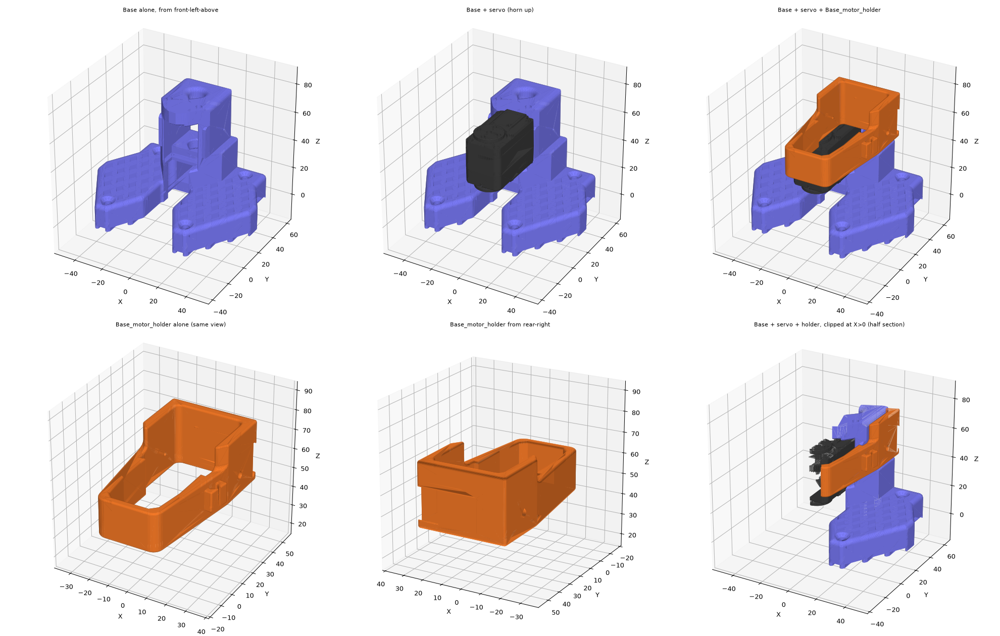
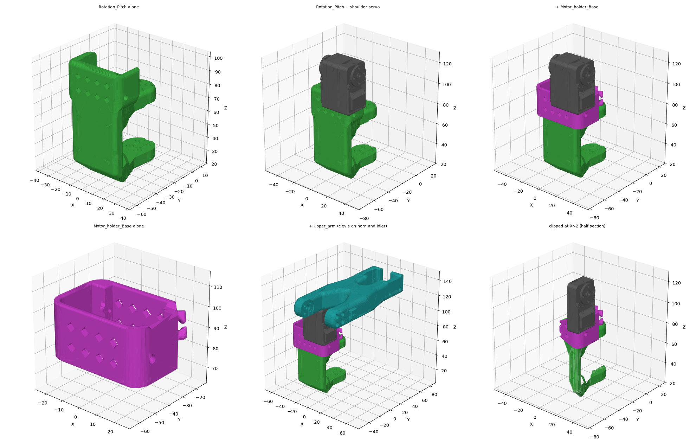

# SO-101 servo joint pattern — what DEC-21 "SO-ARM compatible" means in numbers

Canonical description of how SO-101 mounts an STS3215 and drives from it, and
the servo interface dimensions the koala socket primitive is built to. Sources,
in order of authority: **calipers on a Waveshare ST3215 and on the maintainer's
printed SO-101 parts** (2026-09-08, `test-log.md`); **the printed-part STEPs**
from [TheRobotStudio/SO-ARM100](https://github.com/TheRobotStudio/SO-ARM100)
`STEP/SO101/`, which are proven by fit; and, for arrangement only, upstream's
assembly STEP. Upstream's *servo model* is not a source: it is hollow on the
Back and its assembly mates are ~1.9 mm off at the shoulder.

Why this exists: both discarded koala drafts (a3f265c, DEC-29) claimed DEC-21
and followed only the servo's outer dimensions. The maintainer, assembling an
SO-101, saw the difference on the bench. The restart brief
([`cad-restart-brief.md`](cad-restart-brief.md)) tells the designer to build
the pattern as one primitive and use it at every joint.




## Terminology — use these words and no others

Stand the servo on its end with the drive horn toward you:

| Word | Servo face | Was called |
|---|---|---|
| **Front** | the face the drive spindle and horn are on | horn face, drive face, horn side |
| **Back** | the opposite face, carrying the idler and the connector bay | back face, idler face, idler side |
| **Bottom** | the end face it stands on, away from the output axis; the M2 ears are near it | rear face, rear end, tail |
| **Top** | the end face nearest the output axis (the axis is offset 12.5 toward it) | front end, nose |
| **Sides** | the two flat, symmetric long faces | width faces, long side faces |

The **output axis** runs Front → Back. **Height** is measured from the Bottom.
Printed-part words follow the servo: a cradle has a **floor** under the Bottom,
a **Front wall** and a **Back wall** (the pair 34.9 apart, which carry the M2
screws), and one **Side wall**; its **open Side** is where the servo enters and
where the collar's **closing wall** goes. The clevis has a **Front plate** on the
drive horn and a **Back plate** on the idler. In `servo_iface.py`: Front = +X,
Back = −X, Bottom = Z 0, Top = Z 45.23, Sides = ±Y.

## The pattern

Every powered joint puts three printed parts around one servo:

1. **Cradle**, part of the structural link: floor, Front wall, Back wall, one
   Side wall; open Side and open Top. It holds the bottom ~17 mm of the case.
   Its Front and Back walls each take one M2 screw into the ears at the lateral
   position nearer the Side wall.
2. **Collar** (upstream "motor holder"): a separate 3 mm sleeve, open at both
   ends, slid down over servo and cradle together. Its closing wall shuts the
   open Side against the servo; its two bosses at the open-Side corners take the
   other two M2 screws. At the base joint the collar is also screwed to the
   tower (two M2 self-taps into Ø1.5 pilots).
3. **Clevis** on the driven link: a Front plate bolted 4×M3 to the drive horn
   and a Back plate bolted 4×M3 to the idler, both horns tapped M3 on the 9.9
   square. The servo is loaded in double shear, never as a cantilever.

Retention is friction in the pocket plus **four M2 self-tappers into the
servo's own ears**, two through the Front wall side and two through the Back
wall side; nothing threads into plastic. The ears stand proud of the case, so a
servo cannot enter a closed pocket lengthwise: every socket admits it through
the open Side and the collar closes that Side afterwards.

**Where it is used** (assembly STEP): base (`Base` + `Base_motor_holder`),
shoulder (`Rotation_Pitch` + `Motor_holder_Base`), wrist pitch (`Under_arm` +
`Motor_holder_Wrist`, the shoulder arrangement on its side). **The elbow is the
exception:** the elbow servo's bottom 20 mm sits in a one-piece saddle at the
far end of `Upper_arm` — floor plus Front and Back walls, both Sides open, all
four M2 screws through those two walls, no collar — and `Under_arm` carries the
elbow clevis.

## The servo, as measured (calipers, 2026-09-08; cheap tool, ±0.3)

The Front and Back are not flat. Each has **three planes**, and they are **not
symmetric about the output axis**. Distances are between the same plane on
Front and Back, across the axis:

| Plane | Front ↔ Back | Front side, from horn seat | Back side, from idler seat |
|---|---|---|---|
| Horn / idler seat (the horns sit flat on it) | **28.8** | 0 | 0 |
| Ear face (carries the M2 holes) | **31.8** | 1.5 | 1.5 |
| Widest face (what the pocket grips) | **~34.8** | 2.5 | **3.5** |
| Drive horn outer face | | **4.3–4.5** | |
| Idler outer face | | | **3.1** (idler thickness, sits flat) |
| Servo boss through the idler | | | 0.7 proud of the idler face |

Closure: 28.8 + 3.1 + 4.3 = 36.2 against the measured **36.4 span**; 28.8 +
2.5 + 3.5 = 34.8. The drive horn is 4.3–4.5 above its seat, so it is thicker
than the idler or sits up on the output boss. The idler is 3.1 thick: a 2.1 mm
tapped body and a 1.0 mm boss that faces **inward** onto the servo; both horns
present **flat outer faces** when fitted. The drive horn is retained by a
**pan-head M3** that stands proud of its face.

Taking the pocket as datum (X = 0 at its centre), the seat mid-plane is
**0.5 toward the Front**, the idler outer face is at **−17.0** and the drive
horn face at **+19.4** (`SOCKET_SEAT_OFFSET`, `SOCKET_IDLER_FACE`,
`SOCKET_DRIVE_FACE`). The idler face is 0.4 *inside* the widest Back plane
(−17.45), which is harmless because the widest region does not reach the
plates:

**Where each plane runs, height from the Bottom** (Back, photos IMG_6993–6995;
Front lengths assumed the same, `[VERIFY]`):

| Height | Region | Plane |
|---|---|---|
| 0 – 5.3 | ears; the Bottom M2 pair at the corners | 31.8 |
| 5.3 – 18.8 | recessed rectangular panel with a small screw | **34.8, the widest — what the pocket grips** |
| 18.8 – 35.2 | connector bay 18.8–24.5, a second M2 pair at ~22 | below the seat plane |
| 35.2 (axis) – 45.4 | Top region | below the seat plane |
| Ø20 pad at the axis | **raised** round seat the idler covers exactly | 28.8 |

The output axis is at 35.2 from the Bottom (spec 22.6 + 12.5 = 35.1).
`socket_reference()` carries this profile with the C/D faces conservatively at
the seat plane, plus idler, boss, drive horn and pan head.

Two consequences for the plates. A Ø28 Back plate at the axis spans heights
21.2–49.2 and so overhangs the connector bay's top 3.3 mm; upstream's Ø24 pad
(23.2–47.2) overhangs it 1.3 mm. Keep the Back plate to **Ø24, or flatten its
Bottom edge**, so the connectors and the cable exit stay clear. And the
centre features are mandatory: the audit now fails on the pan head into the
flat Front plate and the boss into the flat Back plate.

Connectors: two, side by side in a **bay recessed into the Back**, immediately
below the idler disc, facing out along the output axis; the cable leaves along
the axis and turns. Seated in a 17 mm cradle the bay sits just above the collar
rim (photos IMG_6990/6991). Two further M2 holes flank the idler disc on the
Back, ~20 mm above the pair the collar uses; the collar's pair are the **ears
near the Bottom**. *To confirm:* bay height from the Bottom; ears at 2.2 and
5.8 with holes.

## The printed parts, as read from their STEPs (part-intrinsic, proven by fit)

| Feature | Value (mm) | Parts |
|---|---|---|
| Clevis span, plate inner face to plate inner face | **36.4** (65.78−29.38; 20.24−(−16.16)) — matches calipers on the servo and on the print | Rotation_Pitch, Upper_arm |
| Clevis plate faces | **flat**, no horn recess; plates bear on the flat horn faces | both |
| Front plate centre | Ø3.2 through, plus a countersink for the drive horn's pan-head screw: cone Ø8 → Ø3.6, 2.4 deep (Rotation_Pitch); Ø7.5 × 1.5 with chamfer (Upper_arm) | both |
| Back plate centre | blind recess Ø6 × 1.0 chamfered to Ø8 (Rotation_Pitch); Ø8 × 1.5 to Ø11 (Upper_arm) — clears the 0.7 servo boss | both |
| Horn screw holes | Ø3.2 (Rotation_Pitch) / Ø3.0 (Upper_arm), 3.53 long, 9.9 square; **teardrop counterbores** for the heads behind the web. **Too small for the M3 horn screws supplied with the Waveshare servos** (maintainer) | both |
| Plate outline at the horn | Ø24 pad, edge chamfered ~1.5 | both |
| Pocket, Front wall ↔ Back wall / Side wall ↔ open Side | **34.9 / 24.7**; `Gauge_0` is the same pocket, a press fit in PLA+ on the reference printer | Rotation_Pitch / Base |
| **Inward bosses at the M2 holes** | wall inner faces at 15.6 and 16.2 from the pocket centre = **31.8**, the ear faces; the wall is 5 elsewhere and ~7.5 at the boss | Rotation_Pitch |
| Cradle depth, floor to wall top | 17–18.5 | Rotation_Pitch |
| Cradle wall thickness | Front/Back 4.8–6.3 (7.5 at the bosses); Side wall 4.8; Base tower 5.0 | Rotation_Pitch, Base |
| M2 hole stack, three of four positions | **Ø2.0 × 2.2 seat, then Ø4.0 counterbore** outward (4.5–7.8 long) | Rotation_Pitch both walls, Base roof, Motor_holder_Base Back boss |
| M2 hole stack, fourth position | **Ø4.0 straight through** the 8.5 boss, no seat | Motor_holder_Base Front boss — bench question |
| Base floor (Back-side ear) | Ø2.0 through a 2.0 floor; heads exposed underneath | Base |
| M2 hole heights from the floor | **Back-side ears 2.2–2.3; Front-side ears 5.7–6.1** — the two faces differ | Rotation_Pitch, Base |
| M2 holes, lateral | ±10.25 from the pocket's Side-to-Side centre | all |
| Base roof ↔ floor | 32.9, clamping the ears (31.8) with ~0.5 each side | Base |
| Collar | 3.0 walls, 26 tall, 9 below the floor, 0.1 per side to the cradle, closing wall 0.16 from the servo Side | Motor_holder_Base |
| Cable | **no window** in any cradle or collar wall; the Base tower has a 24.7 × 22 window in the wall behind the Bottom (height 7.6–29.7) | Rotation_Pitch, Motor_holder_Base, Base |
| Screws in the upstream model | #1-42 × 3/16" ≈ M2 × 4.8 self-tap (the supplied M2×5); M3 × 6 pan head | assembly labels |
| Screws actually supplied (Waveshare box) | M2×5 self-tap; **M3×6 pan head, head Ø5.2 × 2.0** — upstream's counterbores are too small for it | calipers 2026-09-08; Feetech packs unverified |

### The M2×5 length problem, answered

The Ø2.0 section is 2.0–2.2 mm long inside a wall bossed inward to the ear
face: ~2.2 mm of plastic under the head, then the ear. The supplied M2×5
reaches. koala's test-log finding of 2026-09-07 ("M2×5 too short for our 3.95 /
6.35 mm walls") is solved by geometry, not longer screws.

## Corrections the koala primitive needs (against DEC-34 as built)

1. **Lug split by lateral position:** Front and Back walls each take the ear
   nearer the Side wall; collar bosses at the open-Side corners take the other
   two. No lanes cut through the cradle walls.
2. **Walls boss inward to 31.8 at the M2 holes**, 34.9 elsewhere.
3. **Flat plates, no Ø20.5 recess.** Front plate: Ø3.2 centre hole with a
   countersink for the pan-head; Back plate: blind centre recess ≥0.7 deep.
4. **Counterbores sized to the supplied M3 horn screw heads**: Ø5.2 × 2.0 pan
   heads, so ≥Ø6 × ≥2.5 pockets over a 3.5 web — the horn pad becomes ~6 thick.
   M3×6 through a 3.5 web leaves 2.5 for a horn whose tapped body is 2.1;
   confirm on the rig that the screw does not bottom before clamping.
5. **No cable slot** in floor or collar; keep the collar top at 17 so the bay
   on the Back clears it.
6. **Case reference with three planes** and their heights, so the audit's
   clearance checks mean something; the Back plate must clear the widest Back
   plane by staying above the region where the case is at full width.
7. Clevis span **36.4**, idler face **−17.0**, drive face **+19.4** in the
   pocket frame (already in `params.py`).

## Reproducing the STEP measurements

From `hardware/`, with the STEPs downloaded from upstream `STEP/SO101/` into `$D`:

```sh
uv run python - <<'PY'
import re
from build123d import import_step, Box, Pos
asm = import_step("$D/SO101 Assembly.step")          # 97 children, 266 solids
def pick(rx, near=None):
    for k in asm.children:
        if re.search(rx, k.label):
            if near is None: return k
            c = k.bounding_box().center()
            if max(abs(c.X-near[0]), abs(c.Y-near[1]), abs(c.Z-near[2])) < 15: return k
parts = {'RotPitch': pick(r'^Rotation_Pitch'), 'Collar': pick(r'^Motor_holder_SO101_Base'),
         'Servo': pick(r'^ST3215', (2, -38, 107))}   # the shoulder servo, output axis X
rod = Pos(0, -38.55, 95) * Box(400, 0.02, 0.02)     # along X through the servo centre
for n, k in parts.items():
    hits = sorted((round(b.min.X, 2), round(b.max.X, 2))
                  for s in k.solids() if (h := s & rod) is not None
                  for b in (t.bounding_box() for t in h.solids()) if b.size.X > 0.05)
    print(n, hits)   # cradle walls [-23.1,-16.8] [18.1,22.9] -> pocket 34.9; collar 3.0 walls
PY
```

Clevis spans come from the same rod probe along the joint axis at 4–8 mm radius
(at the axis itself the probe falls into the centre recess — the source of an
earlier 37.5 error); hole stacks from listing cylindrical faces around each
hole; gauge pockets from trimesh sections of the STLs.
